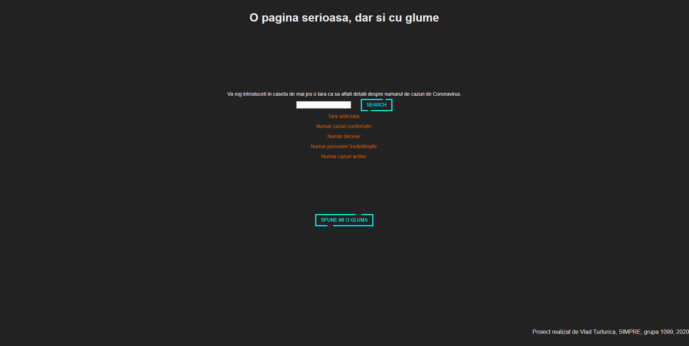
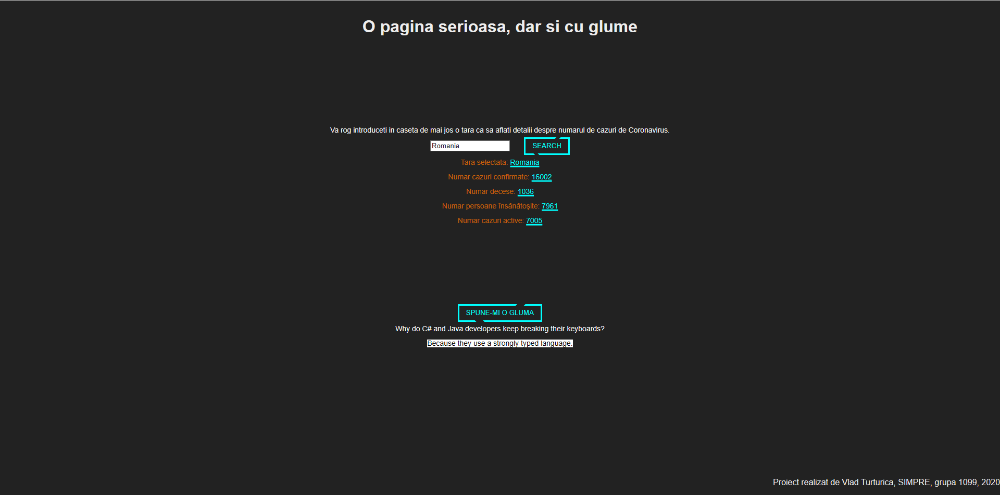

Introducere: Acest proiect s-a axat in prima parte pe aducerea de statistici dintr-o anumita tara despre Coronavirus, iar in a doua parte am creat un buton care ne trimite cate o gluma.

Descriere problemă: Am creat aceasta aplicatie deoarece voiam sa aflu date despre persoanele infectate cu coronavirus fara a accesa o multitudine de tabele cu foarte multe tari precum majoritatea site-urilor prezinta faptele. Astfel vom introduce o tara pe care dorim sa o cautam si vom afla informatii precum: numar cazuri confirmate, numar decese, numar persoane care sunt sanatoase si numar cazuri active in acest moment. In a doua parte am decis sa creez  un buton care sa transmita o gluma, dar care ascunde punchline-ul pentru a putea citi mai intai gluma.

Descriere API: Datele extrase despre cazurile de coronavirus sunt luate din API-ul transmis de catre "https://api.covid19api.com/" unde se pot primi mai multe rezultate. Eu am decis sa utilizez doar cele mai recente date, chiar daca API-ul poate sa ofere mai multe informatii precum date din prima zi. Aceste date sunt oferite sub forma de json si am parsat datele ca sa le pot afisa sub forma usor de citit de catre un utilizator. Asemanator am utilizat un API oferit de catre "https://official-joke-api.appspot.com/" continand glume si am primit ca raspuns o gluma sub format JSON unde am translatat-o intr-o forma usor de citit.

Flux de date: In partea de Frontend trimitem un request de tip POST catre backend pentru a cere date despre o anumita tara. Backend-ul apoi comunica cu API-ul si face un request de tip GET. API-ul returneaza sub forma de JSON date despre acea tara, iar apoi backend-ul returneaza informatia catre frontend pentru a o afisa utilizatorului.

Screenshoturi:
Pagina fara request-uri trimise

Pagina cu request-uri trimise
